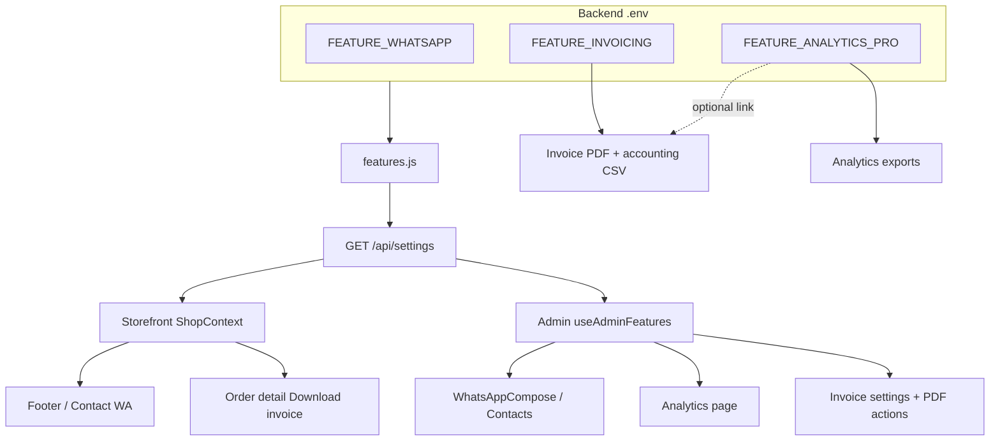

# Implementation plan — Analytics Pro, Invoicing & WhatsApp wiring

**Purpose:** Build three sellable modules on the existing Zayn Leathers stack:

1. **Advanced analytics & export suite** (`FEATURE_ANALYTICS_PRO`)
2. **Invoices, optional GST, credit notes & accounting export** (`FEATURE_INVOICING`)
3. **WhatsApp feature flag wiring** (`FEATURE_WHATSAPP`) — env-gated everywhere, not hard-coded on

**Last updated:** 20 August 2026  
**Estimated total effort:** ~3–4 weeks (one developer), phased

---

## Executive summary

| Module | Env flag | Default (proposal) | Who sees it |
|--------|----------|-------------------|-------------|
| WhatsApp Lite | `FEATURE_WHATSAPP=false` | Off until client buys | Admin ops + optional storefront contact |
| Analytics Pro | `FEATURE_ANALYTICS_PRO=false` | Off | Admin only |
| Invoicing | `FEATURE_INVOICING=false` | Off | Admin + customer (download) |

**Design principle for invoices:** Every registered brand gets a **professional bill/invoice** with legal name, address, logo, line items, and payment summary. **GST is optional** — when the seller has no GSTIN, generate a **Commercial Invoice / Bill** (not a tax invoice). When GSTIN is configured, same flow adds HSN, CGST/SGST/IGST breakdown and becomes a **Tax Invoice**. Buyer GSTIN is also optional (B2B customers only).

---

## Current state (honest baseline)

| Area | Today | Gap |
|------|-------|-----|
| Dashboard | `GET /api/order/dashboard` — revenue, payment mix, status counts, recent orders | No date range, no product/coupon drill-down, no period compare |
| CSV export | Client-side in `admin/src/pages/Orders.jsx` via `downloadOrdersCsv` | Basic columns only; no accounting/GST columns |
| Packing slip | Print CSS in `OrderDetail.jsx` — hard-coded “Zayn Leathers packing slip” | Not a legal invoice; no invoice number; no GST |
| Site settings | Commerce, homepage, policies in `SiteSettings` | No seller legal/GST block |
| Product model | Name, price, SKU, size matrix | No HSN, no default GST rate |
| WhatsApp | `FEATURE_WHATSAPP` in `features.js` but **UI ignores flag** | Admin compose + storefront footer/contact always show if brand config has URL |
| Feature exposure | `GET /api/settings` → `settings.features` | Admin app does **not** load settings.features globally |

---

## Feature flags (central wiring)

**File:** `backend/config/features.js`

Add:

```js
analyticsPro: truthy(process.env.FEATURE_ANALYTICS_PRO),
invoicing: truthy(process.env.FEATURE_INVOICING),
// whatsapp already exists — change default to false for sellable packaging:
whatsapp: truthy(process.env.FEATURE_WHATSAPP), // no ?? "true"
```

**File:** `backend/.env.example`

```env
FEATURE_WHATSAPP=false
FEATURE_ANALYTICS_PRO=false
FEATURE_INVOICING=false
```

**Rule:** Every UI surface checks `settings.features.<name> === true` (storefront via `ShopContext`, admin via shared hook). Backend routes return `403` or `{ success: false, enabled: false }` when flag is off — never leak data from disabled modules.

---

## Phase 0 — WhatsApp env wiring ✅ SHIPPED

WhatsApp is already listed as a sellable module in `docs/WHITE_LABEL_ADDON_FEATURES.md` but is **not gated in the UI**. Fix before shipping paid tiers.

### 0.1 Backend

- [x] `features.js`: remove default `?? "true"` for `whatsapp` so unset env = **false**
- [x] Optional admin-only endpoint already covered by `enrichSettings` → `features.whatsapp`
- [ ] No new API needed for Lite (click-to-chat only)

### 0.2 Admin — load features once

**Added:** `admin/src/context/AdminFeaturesContext.jsx` + provider in `App.jsx`

### 0.3 Admin — hide WhatsApp when off

| File | Change |
|------|--------|
| `admin/src/components/WhatsAppCompose.jsx` | Returns null when feature off |
| `admin/src/pages/OrderDetail.jsx` | Compose self-gates |
| `admin/src/pages/Orders.jsx` | Hide WhatsApp button + modal gate |
| `admin/src/pages/UserDetail.jsx` | Compose self-gates |
| `admin/src/pages/Contacts.jsx` | Hide `wa.me` link |
| `admin/src/pages/Settings.jsx` | Module status badges |

### 0.4 Storefront — hide WhatsApp when off

| File | Change |
|------|--------|
| `frontend/src/components/Footer.jsx` | Gate contact + social WA icon |
| `frontend/src/pages/Contact.jsx` | Gate WhatsApp CTA block |
| `frontend/src/pages/Products.jsx` | **Keep** “Share on WhatsApp” (user share) |

### 0.5 UX copy when disabled

- Admin Settings → **Modules** strip: grey badge “WhatsApp — not included in your plan” with env var name for your ops team (not shown to end client on storefront)
- No broken empty panels — components return `null`, not “feature unavailable” boxes on every page

### 0.6 Acceptance tests

- [ ] `FEATURE_WHATSAPP=false` → no compose panel, no footer WhatsApp, Contact page has no WA button
- [ ] `FEATURE_WHATSAPP=true` + brand `whatsappUrl` set → current behaviour restored
- [ ] `FEATURE_WHATSAPP=true` but empty `whatsappUrl` → hide links (config incomplete)

---

## Phase 1 — Invoicing & accounting ✅ SHIPPED (v1)

### 1.1 Document types (core logic)

**New file:** `backend/utils/invoicing/documentTypes.js`

| Seller GSTIN | Buyer GSTIN | Document title | GST columns |
|--------------|-------------|----------------|-------------|
| Empty | Any | **Bill / Commercial Invoice** | Hidden; single “Amount” column |
| Set | Empty | **Tax Invoice** | CGST/SGST or IGST per line |
| Set | Set | **Tax Invoice** | Same + “Bill To GSTIN” on PDF |

**Invoice number format (configurable):**

- Default: `{PREFIX}-{FY}-{SEQ}` e.g. `TL-2526-000142`
- Sequence stored in DB, incremented atomically per financial year

**Credit note:**

- Linked to original invoice number + order id
- Issued on full/partial return or cancellation after invoice issued
- Own sequence: `CN-{FY}-{SEQ}`

### 1.2 Data model changes

**`SiteSettings` — new block `invoiceConfig`:**

```js
invoiceConfig: {
  enabled: { type: Boolean, default: true }, // admin can pause generation
  legalName: { type: String, default: "" },      // falls back to brand.legalName
  tradeName: { type: String, default: "" },      // display name on PDF
  address: { type: String, default: "" },
  city: { type: String, default: "" },
  state: { type: String, default: "" },
  pincode: { type: String, default: "" },
  phone: { type: String, default: "" },
  email: { type: String, default: "" },
  gstin: { type: String, default: "" },          // OPTIONAL — empty = non-GST bill
  pan: { type: String, default: "" },              // optional
  stateCode: { type: String, default: "" },        // auto from state if GSTIN set
  invoicePrefix: { type: String, default: "INV" },
  creditNotePrefix: { type: String, default: "CN" },
  defaultGstRate: { type: Number, default: 12 }, // leather apparel common slab; per-product override
  pricesIncludeGst: { type: Boolean, default: true }, // Indian D2C norm
  footerNotes: { type: String, default: "" },    // “Thank you…”, return policy one-liner
  bankDetails: { type: String, default: "" },    // optional multiline for B2B
  showPaymentIds: { type: Boolean, default: true }, // Razorpay payment id on PDF
  autoEmailOnDelivered: { type: Boolean, default: false },
}
```

**`productModel` — optional tax fields:**

```js
hsnSac: { type: String, default: "" },
gstRate: { type: Number, default: null }, // null = use site default
```

**`orderModel` — snapshot + documents:**

```js
billing: {
  gstin: { type: String, default: "" },       // optional buyer GSTIN
  companyName: { type: String, default: "" }, // optional
},
invoice: {
  number: String,
  issuedAt: Date,
  type: { type: String, enum: ["bill", "tax_invoice"], default: "bill" },
  pdfUrl: String,           // Cloudinary or local storage path
  totals: {
    taxable: Number,
    cgst: Number,
    sgst: Number,
    igst: Number,
    grandTotal: Number,
  },
  sellerSnapshot: Object,   // frozen copy of invoiceConfig at issue time
},
creditNotes: [{
  number: String,
  issuedAt: Date,
  reason: String,
  amount: Number,
  pdfUrl: String,
  lineItems: Array,
}],
couponSnapshot: { code: String, discount: Number }, // if not already on order
```

**New collection `InvoiceSequence` (or embed in SiteSettings):**

```js
{ key: "invoice-2526", seq: 142 }
```

### 1.3 GST math (when seller GSTIN present)

**New file:** `backend/utils/invoicing/gstBreakdown.js`

- Input: line items (price, qty, gstRate), seller state, buyer state (from address)
- If `pricesIncludeGst`: back-calculate taxable value
- Same state → CGST + SGST (50/50); different state → IGST
- Round to 2 decimals per line; document rounding rule in PDF footnote

When **no seller GSTIN**: skip all tax columns; PDF shows subtotal, discount, shipping, grand total only.

### 1.4 PDF generation

**Recommended:** `pdfkit` (lightweight, no headless Chrome on Render)

**New files:**

- `backend/utils/invoicing/renderInvoicePdf.js`
- `backend/utils/invoicing/renderCreditNotePdf.js`
- `backend/templates/invoice/` — layout constants (logo URL from brand, A4)

**PDF sections (all modes):**

1. Header — logo, trade name, seller address, phone, email  
2. Document title — “TAX INVOICE” or “INVOICE / BILL”  
3. Meta — invoice #, date, order #, place of supply  
4. Bill to — customer name, address, phone; GSTIN line only if provided  
5. Line table — item, SKU, HSN (if GST), qty, rate, amount [+ tax cols if GST]  
6. Totals — subtotal, coupon, delivery, grand total  
7. **Payment details block** (always when data exists):
   - Method: COD / Razorpay / Partial  
   - Paid: Yes/No  
   - Razorpay Payment ID, Order ID (if online)  
   - Partial: advance paid, balance due, balance collected date  
8. Footer — `footerNotes`, optional bank details  

**Storage:** Upload PDF to Cloudinary `invoices/` folder; store URL on order. Regenerate only if admin clicks “Re-issue” (audit log later).

### 1.5 API routes

**New router:** `backend/routes/invoiceRoutes.js` (all gated `FEATURE_INVOICING`)

| Method | Path | Auth | Purpose |
|--------|------|------|---------|
| GET | `/api/invoice/config` | admin | Read `invoiceConfig` |
| PUT | `/api/invoice/config` | admin | Update seller details |
| POST | `/api/invoice/issue/:orderId` | admin | Generate invoice if not exists |
| GET | `/api/invoice/:orderId/pdf` | admin | Download / stream PDF |
| POST | `/api/invoice/credit-note/:orderId` | admin | Body: `{ reason, itemIds?, amount? }` |
| GET | `/api/invoice/my/:orderId/pdf` | customer | Own order only |
| GET | `/api/invoice/export/accounting` | admin | Query: `from`, `to`, `format=csv` |

**Middleware:** `requireFeature('invoicing')` in `backend/middleware/requireFeature.js`

**Checkout (optional buyer GST):**

- `PlaceOrder.jsx` — collapsible “Business purchase (optional)” → GSTIN + company name  
- Validate GSTIN format (15 char); never block checkout if invalid — warn only  
- Save to `order.billing`

### 1.6 Admin UX

**Settings → new tab “Invoices & tax”**

```
┌─────────────────────────────────────────────────────────┐
│ Invoices & tax                          [Module: ON]    │
├─────────────────────────────────────────────────────────┤
│ Legal / trade name    [ Zayn Leathers Pvt Ltd        ]   │
│ Registered address    [ multiline                     ]   │
│ GSTIN (optional)      [ _______________ ]  ← empty OK   │
│   ℹ Without GSTIN, customers get a standard Bill, not   │
│     a Tax Invoice. You can add GSTIN later.               │
│ Default GST %         [ 12 ]   Prices include GST [✓]   │
│ Invoice prefix        [ TL ]   Next preview: TL-2526-…  │
│ Footer notes          [ Thank you for shopping…       ]   │
│ Bank details (opt.)   [ multiline for B2B             ]   │
│ Show payment IDs on PDF                          [✓]    │
│ Email invoice when order delivered               [ ]    │
│                              [ Save invoice settings ]  │
└─────────────────────────────────────────────────────────┘
```

**Order detail — Documents card**

```
┌─ Documents ─────────────────────────────────────────────┐
│ Invoice    TL-2526-000142   19 Aug 2026   [Download]  │
│            Not issued yet              [Generate invoice] │
│ Credit notes (0)                        [Issue credit note]│
└─────────────────────────────────────────────────────────┘
```

- **Generate invoice** disabled until order has at least one non-cancelled item  
- **Issue credit note** opens modal: reason preset (Return, Cancellation, Price adjustment), amount auto from returned lines  
- Print packing slip stays separate (warehouse); invoice is legal/finance doc  

**List page:** optional column “Inv” with tick if `order.invoice.number` exists

### 1.7 Storefront UX

**Customer `OrderDetail.jsx`:**

- When `features.invoicing` && order `Delivered` (or admin issued early):  
  **Download invoice** button (primary outline)  
- If only packing-style needed before delivery: hide until delivered or config allows on “Shipped”  
- No GST jargon on button — label **“Download invoice”** for both bill and tax invoice  

### 1.8 Share invoice & PDF on WhatsApp (requires WhatsApp Lite)

When **both** `FEATURE_INVOICING` and `FEATURE_WHATSAPP` are on:

| Surface | Action |
|---------|--------|
| Admin order detail | **Share invoice on WhatsApp** — opens `wa.me` with pre-filled text + public PDF link |
| Admin order detail | **Share credit note on WhatsApp** — same pattern for CN PDF |
| Customer order detail | **Send invoice on WhatsApp** — opens chat to customer’s number with download link (mobile) or copy link (desktop) |

**Implementation notes:**

- PDF must be reachable via HTTPS URL (Cloudinary `secure_url`) — WhatsApp cannot attach local files from browser; message includes link + short summary (invoice #, amount, order ref).
- **New helper:** `admin/src/utils/whatsapp.js` → `buildDocumentShareText({ type: 'invoice'|'credit_note', order, docUrl })`
- Gate buttons with `features.whatsapp && features.invoicing` (admin) / same via `settings.features` (storefront).
- Optional template in compose dropdown: “Invoice ready” auto-inserts link when invoice exists.

### 1.9 Accounting export (CSV)

**Endpoint:** `GET /api/invoice/export/accounting?from=2026-04-01&to=2026-06-30`

**Columns (non-GST client):**

`Date, InvoiceNo, OrderId, Customer, Phone, State, TaxableValue, CGST, SGST, IGST, Total, PaymentMethod, Paid, RazorpayPaymentId, CouponCode, Status`

When seller has no GSTIN: tax columns = 0; `TaxableValue` = line total.

**Columns (GST client — GSTR-1 friendly extras):**

Add `HSN, GSTIN_Buyer, PlaceOfSupply, DocumentType`

**UX:** Admin → **Analytics & exports** page (or Invoices tab) → date range → **Download accounting CSV**

### 1.10 Product admin — HSN (when invoicing on)

- Edit/Add product: optional **HSN/SAC** + **GST %** fields (only visible when `features.invoicing`)  
- Bulk default: empty HSN → use site default HSN for “4203” leather goods in settings (optional field)

### 1.11 Acceptance tests — invoicing

- [ ] Seller no GSTIN → PDF title “INVOICE”, no tax rows, brand details present  
- [ ] Seller GSTIN + Maharashtra buyer → CGST/SGST split  
- [ ] Seller GSTIN + other state buyer → IGST  
- [ ] Buyer GSTIN optional → appears on PDF when filled  
- [ ] Partial payment order → advance + balance on PDF  
- [ ] Razorpay order → payment id on PDF when `showPaymentIds`  
- [ ] Credit note references original invoice  
- [ ] `FEATURE_INVOICING=false` → no buttons, APIs 403  
- [ ] Customer cannot download another user’s PDF  
- [ ] With WhatsApp ON: admin “Share invoice on WhatsApp” opens compose with PDF URL  
- [ ] With WhatsApp OFF: no share buttons; download still works  

---

## Phase 2 — Advanced analytics & export suite ✅ SHIPPED (v1)

### 2.1 Scope

Move beyond dashboard cards into an **Analytics** admin section with filters, comparisons, and exports — gated by `FEATURE_ANALYTICS_PRO`.

**Keep existing dashboard** for all clients (lite). Pro adds `/analytics` page.

### 2.2 Metrics (v1)

| Metric | Source | Notes |
|--------|--------|-------|
| Gross revenue | Orders `amount` in range | Exclude cancelled if config says so |
| Net revenue | Gross − returns/refunds | Use credit notes / return status |
| Orders count | Distinct orders | |
| AOV | revenue / orders | |
| Payment mix | COD / Razorpay / Partial | Pie + table |
| Status funnel | Item statuses | Same as dashboard but filtered |
| Top products | Unwind `items` | By revenue & units |
| Top categories | `department` snapshot | |
| Coupon performance | Orders with coupon | Uses count, discount total |
| RTO / returns rate | Status filters | % of delivered |
| New vs repeat customers | `userId` first order date | |
| Period compare | Two ranges | % change badges |

### 2.3 API

**New router:** `backend/routes/analyticsRoutes.js`

| Method | Path | Query params |
|--------|------|--------------|
| GET | `/api/analytics/summary` | `from`, `to`, `compareFrom`, `compareTo` |
| GET | `/api/analytics/products` | `from`, `to`, `limit`, `sort=revenue` |
| GET | `/api/analytics/coupons` | `from`, `to` |
| GET | `/api/analytics/export/orders` | `from`, `to`, `format=csv` |
| GET | `/api/analytics/export/products` | `from`, `to` |
| GET | `/api/analytics/export/customers` | `from`, `to` |

**Implementation:** Mongo aggregation pipelines in `backend/utils/analytics/` — reuse patterns from `orderController` dashboard.

**Performance:** Index `orders.createdAt`, `orders.paymentMethod`; cap exports at 10k rows with warning.

### 2.4 Admin UX — Analytics page

**Route:** `admin/src/pages/Analytics.jsx`  
**Sidebar:** “Analytics” with chart icon — **only if** `features.analyticsPro`

**Layout:**

```
┌──────────────────────────────────────────────────────────────┐
│ Analytics Pro                    [Last 30 days ▼] [Compare ✓] │
├──────────────────────────────────────────────────────────────┤
│  ₹4.2L Revenue  ↑12%    186 Orders  ↑8%    ₹2,258 AOV  ↓2%   │
├──────────────────────────────────────────────────────────────┤
│ [Revenue chart — daily bars]     │ [Payment mix donut]       │
├──────────────────────────────────────────────────────────────┤
│ Top products (table)             │ Coupon ROI (table)        │
├──────────────────────────────────────────────────────────────┤
│ Exports: [Orders CSV] [Products CSV] [Customers CSV]         │
│          [Accounting CSV → links to invoicing export if on]  │
└──────────────────────────────────────────────────────────────┘
```

**UX rules:**

- Date presets: Today, 7d, 30d, MTD, last month, custom range  
- Loading skeletons on cards; empty state “No orders in this period”  
- Compare mode: ghost period on chart + green/red delta on KPIs  
- Mobile: stack cards; table horizontal scroll  
- Dashboard lite **unchanged** — Pro is additive, not a paywall on login  

### 2.5 Enhance existing Orders CSV (Pro)

When analytics pro on, replace basic export with server-side export including:

- All line items (one row per item)  
- SKU, size, colour, department  
- Item status, return flags  
- Invoice number (if invoicing module on)  

When analytics pro off, keep current client-side CSV in Orders list.

### 2.6 Optional phase 2.5 — Email digest

- Weekly email to `ADMIN_EMAIL` with KPI summary  
- Requires `FEATURE_ANALYTICS_PRO=true` and mail configured  
- Defer if time-boxed  

### 2.7 Acceptance tests — analytics

- [ ] Date filter changes all widgets  
- [ ] Compare shows correct % delta  
- [ ] Export CSV opens in Excel; dates ISO  
- [ ] `FEATURE_ANALYTICS_PRO=false` → sidebar hidden, APIs 403  
- [ ] Large date range doesn’t timeout (< 5s on 5k orders target)  

---

## Cross-module wiring



---

## File checklist (implementation order)

### Phase 0 — WhatsApp

| Action | File |
|--------|------|
| Edit | `backend/config/features.js` |
| Edit | `backend/.env.example` |
| Add | `admin/src/hooks/useAdminFeatures.js` |
| Edit | `admin/src/App.jsx` |
| Edit | `admin/src/components/WhatsAppCompose.jsx` |
| Edit | `admin/src/pages/OrderDetail.jsx`, `Orders.jsx`, `UserDetail.jsx`, `Contacts.jsx`, `Settings.jsx` |
| Edit | `frontend/src/components/Footer.jsx`, `pages/Contact.jsx` |

### Phase 1 — Invoicing

| Action | File |
|--------|------|
| Edit | `backend/models/SiteSettings.js`, `orderModel.js`, `productModel.js` |
| Add | `backend/models/InvoiceSequence.js` (optional) |
| Add | `backend/utils/invoicing/*` |
| Add | `backend/middleware/requireFeature.js` |
| Add | `backend/controllers/invoiceController.js` |
| Add | `backend/routes/invoiceRoutes.js` |
| Edit | `backend/server.js` — mount routes |
| Edit | `backend/controllers/orderController.js` — save billing fields |
| Edit | `backend/controllers/productController.js` — HSN/gstRate |
| Add | `admin/src/pages/InvoiceSettings.jsx` or tab in Settings |
| Edit | `admin/src/pages/OrderDetail.jsx` — Documents card |
| Edit | `admin/src/pages/Edit.jsx`, `Add.jsx` — HSN fields |
| Edit | `frontend/src/pages/PlaceOrder.jsx` — optional GSTIN |
| Edit | `frontend/src/pages/OrderDetail.jsx` — download button |

### Phase 2 — Analytics

| Action | File |
|--------|------|
| Add | `backend/utils/analytics/*` |
| Add | `backend/controllers/analyticsController.js` |
| Add | `backend/routes/analyticsRoutes.js` |
| Add | `admin/src/pages/Analytics.jsx` |
| Edit | `admin/src/components/SideBar.jsx` |
| Edit | `admin/src/App.jsx` — route |
| Edit | `admin/src/pages/Orders.jsx` — pro export button |

---

## Dependencies (npm)

| Package | Use |
|---------|-----|
| `pdfkit` | Invoice & credit note PDFs |
| (optional) `date-fns` | Date range helpers in analytics |

No Puppeteer on Render (memory/cold start).

---

## Client packaging (sales)

| Bundle | Modules | Typical price story |
|--------|---------|---------------------|
| **Ops** | WhatsApp Lite | “Message customers from admin” |
| **Finance** | Invoicing | “Professional bills + optional GST + CA export” |
| **Growth** | Analytics Pro | “Know what sells; export everything” |
| **Pro combo** | All three | Best margin |

---

## Risks & mitigations

| Risk | Mitigation |
|------|------------|
| GST calculated wrong | Snapshot rates on order; CA disclaimer in footer; manual credit note |
| PDF storage costs | Cloudinary; optional TTL for old PDFs |
| Invoice re-number gaps | Atomic sequence; never delete numbers |
| Admin without GST sells inter-state | IGST auto from states; test matrix in QA |
| Feature flag forgotten on deploy | Settings page shows active modules; smoke test checklist |

---

## QA smoke script (before client handoff)

1. Set all three flags `false` → verify no WA, no analytics nav, no invoice buttons  
2. Enable WhatsApp only → admin compose works; storefront footer WA works  
3. Enable Invoicing → configure brand without GST → place order → generate PDF → customer download  
4. Add seller GSTIN → new order → tax invoice with CGST/SGST  
5. Enable Analytics → pick 30d → export orders CSV → row count matches  
6. Return order → issue credit note → accounting CSV shows CN row  

---

## Decision log (for your review)

| Decision | Choice | Rationale |
|----------|--------|-----------|
| GST required? | **No** — optional seller + buyer | Unregistered brands still need invoices |
| PDF vs HTML print | **PDF** stored on order | Email attachment + consistent layout |
| WhatsApp share on PDP | **Not gated** | User-initiated share ≠ business module |
| Default WhatsApp flag | **false** | Matches sellable add-on model |
| Dashboard vs Analytics | **Separate page** | Don’t break free tier |

---

*When you approve this plan, implementation order recommended: **Phase 0 → Phase 1 → Phase 2**. Say which phase to start and we will implement.*
